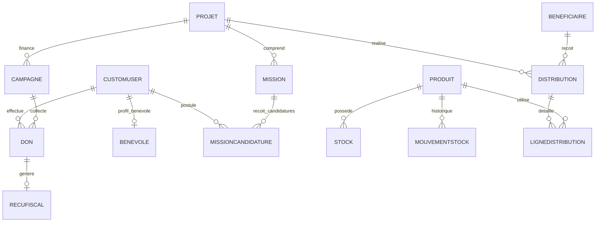

# RoBomed RHMS — Documentation Technique Complète
**RoBomed Humanitarian Management System**  
*Système Intégré de Gestion des Opérations Humanitaires, Dons, Bénévoles et Distributions*

---

## 1. Présentation Générale du Projet

Le système **RoBomed RHMS** (RoBomed Humanitarian Management System) est une plateforme logicielle complète conçue pour piloter et informatiser l'ensemble des activités de l'organisation humanitaire **RoBomed**.

L'association opère sur plusieurs axes humanitaires stratégiques :
* **Accès à l'eau potable & Énergie verte** : Forages solaires et châteaux d'eau automatisés (ex. Mandélia, Tchad).
* **Éducation & Jeunesse** : Rentrée solidaire, confection et distribution de cartables, livres et manuels scolaires (ex. Mongo, Guéra).
* **Santé & Soins Hospitaliers Pédiatriques** : Friandises solidaires, peluches et soutien moral aux enfants en oncologie pédiatrique (Québec).
* **Réconfort & Bienveillance pour Aînés** : Confection et livraison de fleurs au crochet et cartes manuscrites en soins palliatifs et résidences pour aînés (Montréal).
* **Urgences Alimentaires et Nutritionnelles** : Distribution de vivres essentiels et kits d'hygiène aux familles vulnérables.

---

## 2. Architecture Logicielle & Choix Technologiques

Le système repose sur une architecture moderne découplée **Backend API REST / Frontend Single Page Application (SPA)** garantissant haute performance, maintenabilité, modularité et sécurité.

```
                      +---------------------------------------+
                      |           UTILISATEURS                |
                      | (Visiteur, Donateur, Bénévole,        |
                      |  Coordinateur, Administrateur)        |
                      +-------------------+-------------------+
                                          |
                                          v  [HTTPS / Navigateur Web]
                      +---------------------------------------+
                      |        FRONTEND SPA (Vite + React)    |
                      |  React 18, TypeScript, Tailwind CSS  |
                      |  Lucide Icons, Axios (JWT Interceptor)|
                      +-------------------+-------------------+
                                          |
                                          v  [REST API / JSON / JWT]
                      +---------------------------------------+
                      |          REVERSE PROXY (Nginx)        |
                      +-------------------+-------------------+
                                          |
                                          v
                      +---------------------------------------+
                      |      BACKEND API (Django REST)        |
                      |  Django 4.2 LTS, DRF 3.14             |
                      |  SimpleJWT, ReportLab (PDF), OpenPyXL |
                      +-------------------+-------------------+
                                          |
                      +-------------------+-------------------+
                      |                                       |
                      v                                       v
         +--------------------------+             +--------------------------+
         |     BASE DE DONNÉES      |             |     STOCKAGE MÉDIAS      |
         | SQLite3 (Développement) |             | Répertoire /media        |
         | PostgreSQL (Production)  |             | (Reçus, Justificatifs,   |
         | (dj-database-url)        |             |  Photos de projets)      |
         +--------------------------+             +--------------------------+
```

### 2.1 Backend
* **Langage & Framework** : Python 3.11+, Django 4.2 LTS, Django REST Framework 3.14.
* **Authentification** : JSON Web Token (JWT) via `djangorestframework-simplejwt` avec tokens Access et Refresh rotatifs.
* **Moteur d'Export & Reporting** :
  * **ReportLab** (`reportlab>=4.0`) : Génération dynamique des rapports d'activité officiels et des reçus fiscaux CERFA en PDF vectoriel avec en-têtes officiels, filigranes et signatures numériques.
  * **OpenPyXL** (`openpyxl>=3.1`) : Génération de classeurs Excel professionnels multi-onglets (Projets, Dons, Stocks, Bénéficiaires, Distributions).
* **Gestion Base de données** : Compatible multi-moteurs via `dj-database-url` (SQLite en local, PostgreSQL 15 en conteneur Docker de production).

### 2.2 Frontend
* **Core & Build** : React 18, TypeScript, Vite.
* **Design & UI** : Tailwind CSS, Lucide React (icônes vectorielles).
* **Routage & État** : React Router DOM v6, React Context API pour la gestion de session utilisateur et le panier de dons.
* **Communication HTTP** : Axios avec intercepteur d'injection automatique du token JWT (`Authorization: Bearer <token>`) et redirection automatique en cas d'expiration de session.

---

## 3. Modèle de Données & Schéma Relationnel

La base de données est structurée en 11 applications modulaires Django :



### 3.1 Détail des Entités Principales

| Entité (Modèle Django) | Table SQL | Rôle fonctionnel |
| :--- | :--- | :--- |
| `accounts.CustomUser` | `accounts_customuser` | Utilisateur unifié avec rôles (`visiteur`, `donateur`, `benevole`, `coordinateur`, `administrateur`), statut d'approbation et flags de sécurité. |
| `projects.Projet` | `projects_projet` | Projets humanitaires avec budget, date début/fin, taux de progression, statut (`en_cours`, `termine`, `a_venir`). |
| `projects.Mission` | `projects_mission` | Missions de terrain rattachées aux projets avec lieu, dates, besoins bénévoles et statut. |
| `projects.MissionCandidature` | `projects_missioncandidature` | Inscriptions et affectations de bénévoles sur une mission avec statut (`en_attente`, `acceptee`, `refusee`). |
| `campaigns.Campagne` | `campaigns_campagne` | Campagnes de levée de fonds avec objectif financier, montant collecté en temps réel et dates. |
| `donations.Don` | `donations_don` | Dons enregistrés (monétaires ou matériels), montant, mode de paiement, statut de validation. |
| `donations.RecuFiscal` | `donations_recufiscal` | Reçus fiscaux générés pour déduction d'impôts avec numéro unique séquentiel et PDF téléchargeable. |
| `stocks.Produit` | `stocks_produit` | Catalogue de fournitures (catégorie, seuil d'alerte, unité : kits, cartons, sacs, etc.). |
| `stocks.Stock` | `stocks_stock` | Quantité physique en entrepôt et valorisation. |
| `stocks.MouvementStock` | `stocks_mouvementstock` | Traçabilité des entrées (achats/dons) et sorties (distributions). |
| `beneficiaries.Beneficiaire` | `beneficiaries_beneficiaire` | Personnes ou communautés cibles (familles, orphelins, aînés, élèves) avec type d'aide et vulnérabilité. |
| `distributions.Distribution` | `distributions_distribution` | Événement de distribution sur le terrain lié à un projet et des bénéficiaires. |
| `distributions.LigneDistribution`| `distributions_lignedistribution`| Articles et quantités précises remis lors d'une distribution avec décrémentation automatique du stock. |
| `volunteers.Benevole` | `volunteers_benevole` | Fiche bénévole : compétences, disponibilités, pièce d'identité et validation administrative. |
| `news.Actualite` | `news_actualite` | Articles et communiqués d'actualités publiés sur le portail public. |
| `gallery.Media` | `gallery_media` | Photos et vidéos de terrain illustrant les actions réalisées. |
| `contacts.Contact` | `contacts_contact` | Messages reçus depuis le formulaire de contact public. |

---

## 4. Spécification Complète de l'API REST

Toutes les routes de l'API sont préfixées par `/api/` et communiquent au format JSON.

### 4.1 Authentification & Comptes (`/api/accounts/`)
* `POST /api/accounts/token/` : Obtention des tokens JWT (`access` et `refresh`) via identifiants (`username`/`email` + `password`).
* `POST /api/accounts/token/refresh/` : Renouvellement du token d'accès sans ressaisie du mot de passe.
* `GET /api/accounts/profile/` : Récupération du profil complet de l'utilisateur connecté avec son rôle.
* `PUT / PATCH /api/accounts/profile/` : Mise à jour des informations personnelles.
* `POST /api/accounts/register/` : Inscription publique d'un nouvel utilisateur (profil donateur ou bénévole).
* `GET /api/accounts/users/` *(Admin)* : Liste de tous les comptes avec pagination et filtres.
* `POST /api/accounts/users/` *(Admin)* : Création d'un utilisateur avec attribution de rôle spécifique.
* `PUT / PATCH /api/accounts/users/{id}/` *(Admin)* : Modification du profil, du rôle ou du statut d'approbation d'un utilisateur.
* `DELETE /api/accounts/users/{id}/` *(Admin)* : Suppression d'un compte.

### 4.2 Projets & Missions (`/api/projects/`)
* `GET /api/projects/projets/` : Liste des projets humanitaires (public).
* `POST /api/projects/projets/` *(Coordinateur, Admin)* : Création d'un projet.
* `GET /api/projects/projets/{id}/` : Détails d'un projet avec missions et indicateurs.
* `PUT / PATCH /api/projects/projets/{id}/` *(Coordinateur, Admin)* : Mise à jour du projet.
* `DELETE /api/projects/projets/{id}/` *(Admin)* : Suppression d'un projet.
* `GET /api/projects/missions/` : Liste des missions de terrain.
* `POST /api/projects/missions/` *(Coordinateur, Admin)* : Création d'une mission.
* `POST /api/projects/missions/{id}/apply/` *(Bénévole connecté)* : Postuler à une mission en un clic.
* `GET /api/projects/missions/{id}/candidatures/` *(Coordinateur, Admin)* : Consultation des bénévoles inscrits.
* `PATCH /api/projects/candidatures/{id}/` *(Coordinateur, Admin)* : Validation ou refus de la candidature bénévole.

### 4.3 Campagnes de Financement (`/api/campaigns/`)
* `GET /api/campaigns/` : Liste des campagnes actives ou terminées (public).
* `POST /api/campaigns/` *(Coordinateur, Admin)* : Création d'une nouvelle campagne.
* `GET /api/campaigns/{id}/` : Détail d'une campagne et progression de collecte.
* `PUT / PATCH /api/campaigns/{id}/` *(Coordinateur, Admin)* : Édition de la campagne.

### 4.4 Dons & Reçus Fiscaux (`/api/donations/`)
* `GET /api/donations/` : Liste des dons (filtrée par utilisateur pour les donateurs, complète pour l'administration).
* `POST /api/donations/` : Enregistrement d'un nouveau don (par carte, virement, PayPal, etc.).
* `GET /api/donations/{id}/` : Consultation d'un don spécifique.
* `GET /api/donations/{id}/recu/` : **Téléchargement direct du reçu fiscal officiel au format PDF (ReportLab)**.
* `GET /api/donations/recus/` : Liste des reçus fiscaux émis.

### 4.5 Gestion des Stocks (`/api/stocks/`)
* `GET /api/stocks/produits/` : Catalogue des articles d'aide humanitaire.
* `POST /api/stocks/produits/` *(Coordinateur, Admin)* : Ajout d'une nouvelle référence de produit.
* `GET /api/stocks/stocks/` : Quantités disponibles en stock avec indicateur de seuil critique.
* `POST /api/stocks/mouvements/` *(Coordinateur, Admin)* : Enregistrement d'une entrée/sortie manuelle avec motif.

### 4.6 Bénéficiaires (`/api/beneficiaries/`)
* `GET /api/beneficiaries/` *(Coordinateur, Admin)* : Répertoire complet des bénéficiaires.
* `POST /api/beneficiaries/` *(Coordinateur, Admin)* : Enregistrement d'un nouveau bénéficiaire (données sensibles protégées).
* `PUT / PATCH /api/beneficiaries/{id}/` *(Coordinateur, Admin)* : Mise à jour du dossier bénéficiaire.

### 4.7 Distributions d'Aide Humanitaire (`/api/distributions/`)
* `GET /api/distributions/` *(Coordinateur, Admin)* : Historique et planification des distributions.
* `POST /api/distributions/` *(Coordinateur, Admin)* : Déclaration d'une distribution avec sélection des bénéficiaires et des articles distribués.
* `GET /api/distributions/{id}/` : Détails de la distribution et des articles alloués.

### 4.8 Gestion des Bénévoles (`/api/volunteers/`)
* `GET /api/volunteers/` *(Coordinateur, Admin)* : Liste des dossiers de candidatures et bénévoles actifs.
* `POST /api/volunteers/` : Dépôt d'un dossier bénévole (compétences, disponibilités).
* `POST /api/volunteers/{id}/approve/` *(Coordinateur, Admin)* : Approbation officielle du bénévole.
* `POST /api/volunteers/{id}/reject/` *(Coordinateur, Admin)* : Rejet motivé de la candidature.

### 4.9 Reporting & Exports Décisionnels (`/api/reports/`)
* `GET /api/reports/kpis/` *(Coordinateur, Admin)* : Synthèse des indicateurs clés (total dons, progression budgétaire, état des stocks, effectif bénévole).
* `GET /api/reports/pdf/` *(Coordinateur, Admin)* : **Génération et téléchargement à la volée du Rapport d'Activité officiel RoBomed (PDF haute résolution structuré avec ReportLab)**.
* `GET /api/reports/excel/` *(Coordinateur, Admin)* : **Génération et téléchargement du Classeur Excel complet multi-feuilles avec OpenPyXL**.

### 4.10 Actualités, Galerie & Contacts
* `GET /api/news/` / `POST /api/news/` : Fil d'actualité et publication d'articles.
* `GET /api/gallery/` / `POST /api/gallery/` : Galerie photos et vidéos des réalisations humanitaires.
* `POST /api/contacts/` : Envoi de messages de contact public.

---

## 5. Sécurité, Rôles & Contrôle d'Accès (RBAC)

Le système implémente une matrice de sécurité stricte par contrôle d'accès basé sur les rôles (Role-Based Access Control) :

| Module / Fonctionnalité | Visiteur | Donateur | Bénévole | Coordinateur | Administrateur |
| :--- | :---: | :---: | :---: | :---: | :---: |
| Découverte Projets & Actualités | Lecture | Lecture | Lecture | Lecture | Lecture |
| Effectuer un Don en ligne | Oui | Oui | Oui | Oui | Oui |
| Consultation de ses propres dons | Non | **Accès total** | Non | Non | Accès global |
| Téléchargement de ses reçus fiscaux | Non | **Oui (PDF)** | Non | Non | Oui (Tous) |
| Postuler aux Missions de terrain | Non | Non | **En 1 clic** | Gestion | Gestion |
| Gestion des Projets & Campagnes | Non | Non | Non | **Création/Édition** | **Total** |
| Gestion des Stocks & Mouvements | Non | Non | Non | **Saisie/Suivi** | **Total** |
| Gestion des Bénéficiaires & Aides | Non | Non | Non | **Création/Suivi** | **Total** |
| Déclaration des Distributions | Non | Non | Non | **Enregistrement** | **Total** |
| Validation des Bénévoles | Non | Non | Non | **Approuver/Rejeter**| **Total** |
| Export Rapports PDF & Excel | Non | Non | Non | **Téléchargement** | **Téléchargement** |
| Gestion des Utilisateurs & Rôles | Non | Non | Non | Non | **Exclusif Admin** |
| Configuration Système & Logs | Non | Non | Non | Non | **Exclusif Admin** |

### Bonnes pratiques de sécurité implémentées :
1. **Mots de passe** : Hachage fort PBKDF2 avec sel unique conforme aux standards OWASP.
2. **Protection CSRF & CORS** : Configuration sécurisée des origines autorisées dans `settings.py`.
3. **Séparation des privilèges** : Le rôle de Coordinateur a accès à la logistique mais n'a pas accès à la gestion des comptes utilisateurs ni à l'élévation de privilèges.
4. **Validation des entrées & Transactions atomiques** : Les opérations sensibles (comme la distribution avec décrémentation de stock) sont exécutées dans des transactions de base de données atomiques (`transaction.atomic()`).

---

## 6. Guide d'Installation et de Déploiement

### 6.1 Prérequis Système
* Python 3.10 ou supérieur
* Node.js 18+ et npm 9+
* Git
* *(Optionnel en production)* Docker & Docker Compose

---

### 6.2 Déploiement Local (Mode Développement)

#### Étape 1 : Cloner et configurer le Backend
```bash
cd /chemin/vers/Robomed/rhms

# Créer et activer l'environnement virtuel Python
python3 -m venv venv
source venv/bin/activate

# Installer les dépendances certifiées
pip install -r requirements.txt

# Appliquer les migrations de la base de données
python manage.py migrate

# Injecter les données de démonstration réalistes (5 profils, projets, dons, etc.)
python seed_database.py

# Démarrer le serveur backend Django
python manage.py runserver 8000
```
*Le backend sera accessible sur : `http://localhost:8000/api/`*

#### Étape 2 : Configurer et démarrer le Frontend
Dans un second terminal :
```bash
cd /chemin/vers/Robomed/rhms/frontend

# Installer les dépendances Node
npm install

# Démarrer le serveur de développement Vite
npm run dev
```
*L'application web sera accessible sur : `http://localhost:5173/`*

---

### 6.3 Déploiement Conteneurisé avec Docker & Docker Compose (Production)

Le projet contient une configuration de conteneurisation prête pour la production avec base PostgreSQL et serveur Web Nginx.

Fichier d'orchestration : `rhms/docker-compose.yml`

```bash
cd /chemin/vers/Robomed/rhms

# 1. Copier et adapter les variables d'environnement
cp .env.example .env

# 2. Construire et démarrer tous les services en arrière-plan
docker compose up -d --build

# 3. Exécuter les migrations dans le conteneur backend
docker compose exec backend python manage.py migrate

# 4. Injecter les données de démonstration
docker compose exec backend python seed_database.py
```

Services démarrés automatiquement :
1. **`db`** : Base de données PostgreSQL 15 sur le port 5432 avec persistance sur volume dédié.
2. **`backend`** : Serveur d'application Django propulsé par Gunicorn sur le port 8000.
3. **`frontend`** : Build de production servi par Nginx sur le port 80 avec redirection automatique des requêtes `/api/` vers le backend.

---

## 7. Tests Automatisés & Validation

Une suite de tests unitaires et d'intégration automatisés couvre les fonctionnalités critiques :
* Création et authentification des utilisateurs par rôle.
* Gestion des stocks et décrémentation automatique lors d'une distribution.
* Enregistrement des dons et génération du reçu fiscal PDF CERFA.
* Génération du rapport d'activité PDF (ReportLab) et du classeur Excel (OpenPyXL).

### Exécution des tests Backend :
```bash
cd /chemin/vers/Robomed/rhms
source venv/bin/activate
python manage.py test
```
*Résultat attendu : 11/11 tests réussis (OK).*

### Validation du Build Frontend :
```bash
cd /chemin/vers/Robomed/rhms/frontend
npm run build
```
*Résultat attendu : Compilation TypeScript / Vite avec 0 erreur.*

---
*Documentation rédigée pour le système RoBomed RHMS — Version 1.0 Production.*
